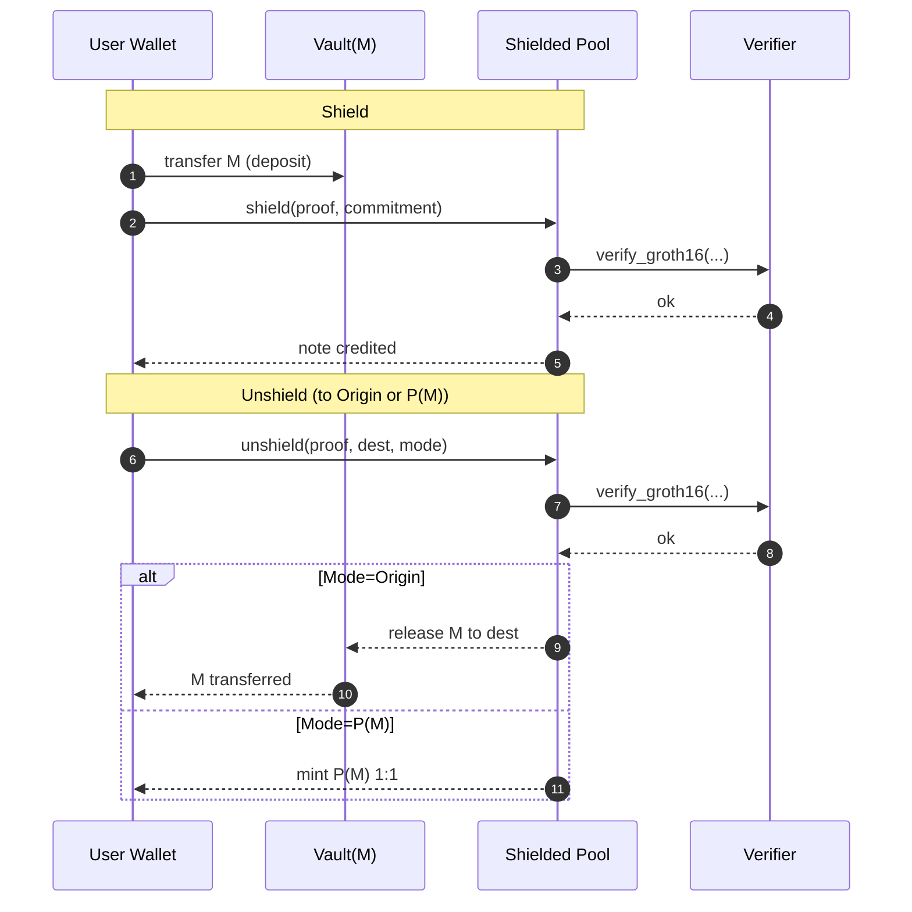

# Solana Privacy Twin Factory — Project Specification
**Edition:** No‑Relayer Core with Relayer‑Ready Hooks  
**Version:** 0.5 (Committed Decisions) • **Date:** 2025‑11‑09  
**Owner:** Hendo  
**Chain:** Solana Mainnet‑Beta (prototype on localnet/devnet)  
**Path:** `docs/solana-privacy-twin-factory-spec-v0.5.md`

---

## 0) Executive Summary (What we’re building)
**Privacy Twin Factory (PTF)** gives any existing SPL token mint (**origin mint** `M`) a **private mode**:
- Users **shield** public tokens `M` into a program‑controlled **Vault** and receive a **private balance** represented by **notes** in a **Shielded Pool** `S(M)`.
- Users may perform **private transfers** **inside** `S(M)` (optional in MVP).
- Users **unshield** back to public tokens in one of two ways:
  - **Origin redeem:** Withdraw the original SPL token `M` to the user’s public ATA.
  - **Twin mint:** Mint a public **privacy twin token** `P(M)` 1:1 to the user’s public ATA (optional feature).

**Important:** This edition **ships without a relayer**. All DEX trades and public transfers after unshield are fully public and performed by the user’s wallet.

**Future‑proofing:** We **reserve strictly defined hooks and extension interfaces** so a relayer can be added later **without** changing core program IDs or breaking state. Hooks are **disabled by default** and carry **zero effect** until explicitly enabled by governance.


---

## 1) Design Stance (Committed)
- **Core privacy boundary:** Inside `S(M)`, sender/receiver/amounts are private (note‑based ZK). Edges (shield/unshield) are public and visible.
- **Relayer posture:** **No relayer** in MVP. We **pre‑wire extension points** (CPI surfaces, events, PDAs) to add one later (opt‑in, governed).
- **Strict supply invariant (per mint `M`):**
  ```text
  balance(Vault(M)) == supply(P(M)) + sum(live_notes(M)) - protocol_fees(M)
  ```
- **Proof system:** Default **Groth16** on **BN254** (fast verify via Solana syscalls). Optional **SP1** or **RISC0** adapters later.
- **State compression:** Use **ZK/State Compression** for commitments and nullifiers; keep on‑chain fingerprints and roots.
- **Governance:** Time‑locked DAO multisig owns upgrades until post‑audit lock or program‑derived authority handoff.
- **Wallet UX:** Client‑side proving (WebWorker/WebGPU). Optional **Proof RPC** (stateless) for slow devices; **never** holds funds.


---

## 2) Glossary (All names are final)
- **Origin mint `M`:** Existing SPL/Token‑2022 token to be made private.
- **Twin mint `P(M)`:** Optional public fungible token backed 1:1 by Vault(M).
- **Vault(M):** PDA that custodies origin tokens during privacy lifecycle.
- **Shielded Pool `S(M)`:** Note commitments + nullifiers + Merkle roots for `M`.
- **Note:** A private balance unit committed as `C`, spendable with a proof.
- **Nullifier:** Unique tag proving a note was spent (prevents double‑spend).
- **Hook:** A CPI call or event a future extension can subscribe to, disabled by default in core build.


---

## 3) Component Overview
```
User Wallet  ──(deposit M)──▶ Vault(M) ──▶ [Shielded Pool S(M)] ──▶ (unshield)
                   ▲                                │
                   │                                ├─ private transfers (optional v1.1)
                   │                                └─ compressed state (roots/nullifiers)
                   └─────────────────────────────────────────────────────────────────
Unshield outputs:
  • Origin Redeem: transfer M → user’s public ATA
  • Twin Mint: mint P(M) 1:1 → user’s public ATA (optional)
```

**Relayer readiness:** Two **disabled** extension rails:
1) **CPI Hook Surface:** `post_unshield_hook` and `post_shield_hook` (no‑op by default).  
2) **Intent/Event Rail:** Program logs + PDA queues reserved for a future “Relayer Adapter” program to claim work.


---

## 4) On‑Chain Programs (Anchor 0.32+, Solana 2.3.x)
**Repo paths:**
- `programs/factory`
- `programs/vault`
- `programs/pool`
- `programs/verifier-groth16`
- (reserved, later) `programs/relayer-adapter` *(NOT deployed in MVP)*

### 4.0.1 Dependency & Feature Baseline (Blocking)
The Anchor 0.32 toolchain is **hard‑pinned** to the Solana **2.3.x** ABI. To avoid the hard failures we hit when trying to mix 3.x crates in, the entire workspace MUST stay on the following stack until Anchor publishes a 3.x‑compatible release:

| Component | Required version / feature | Notes |
|-----------|---------------------------|-------|
| Rust toolchain | `stable` 1.78+ | Need `cargo fmt` edition 2021. |
| Anchor crates (`anchor-lang`, `anchor-spl`) | `0.32.1` | Ships with Solana 2.3.x bindings; do **not** override individual Solana deps. |
| `solana-program`, `solana-sdk`, `solana-program-test`, `solana-instruction`, etc. | `2.3.x` line | Pulled transitively from Anchor; no 3.x crates in the dependency tree. |
| `spl-token`, `spl-associated-token-account`, `spl-token-2022` | `8.x` | Matches Anchor’s token_interface module. |
| `ptf-vault` | features `["no-entrypoint", "cpi"]` | Required so pool CPI calls compile. |
| `ptf-factory` | features `["no-entrypoint", "cpi"]` | Pool relies on `ptf_factory::cpi::mint_ptkn`. |
| `ptf-pool` | use `InterfaceAccount<'info, Mint/TokenAccount>` everywhere | Needed for Token‑2022 compatibility and to remove owner checks. |

**Rule:** We only upgrade to the Solana 3.x stack once Anchor publishes an official build that exposes the new `AccountInfo` layout, `ProgramTest` glue, and CPI shims. Until then, attempting to patch in 3.x crates causes type mismatches (two `AccountInfo` structs, incompatible `ProgramResult`, private `entry` wrappers). Documented errors from the aborted attempt:
1. `ProgramTest::new(..., processor!(crate::entry))` rejected because `crate::entry` exports the Anchor (2.x) ABI, not the new 3.x function pointer.
2. CPI helpers failed with *“expected solana_sdk::instruction::Instruction, found anchor_lang::solana_program::instruction::Instruction”* due to duplicated crates.
3. `solana_program::system_instruction` / `system_program` modules disappeared upstream, forcing invasive refactors throughout Factory tests.

Therefore **do not** raise any Solana crate above 2.3.x (and do not add 3.x transitive deps) until the entire stack upgrades in lockstep.

### 4.1 Factory Registry (finalized API)
**Purpose:** One mapping from `origin_mint` → **optional** `P(M)`; owns mint authority of `P(M)` when enabled.

**PDAs:**
- `FactoryState` (seeds: `[b"factory", factory_program_id]`): fees default, feature flags, DAO, pause.
- `MintMapping(M)` (seeds: `[b"map", origin_mint]`): `{ ptkn_mint?: Pubkey, status: Active|Frozen, decimals, flags }`.

**Instructions (IDL‑stable):**
- `register_mint(origin_mint, decimals, enable_ptkn: bool)` → creates mapping, optionally creates `P(M)` and assigns mint authority to Factory.
- `update_mint(origin_mint, params)` → update flags (e.g., enable_ptkn), fee bps override.
- `freeze_mapping(origin_mint)` / `thaw_mapping(origin_mint)`.
- `pause()` / `unpause()` (global circuit breaker).

**Decisions:**
- **Decimals:** `P(M)` decimals **match** `M` by default (committed).
- **Mint authority:** `FactoryState` PDA; **no EOAs** hold mint authority.
- **Token programs:** Support **SPL** and **Token‑2022** seamlessly.

### 4.2 Vault (finalized API)
**Purpose:** Program‑owned custody for origin mint `M` balances.

**Accounts:**
- `Vault(M)` PDA (seeds: `[b"vault", origin_mint]`) holds ATA for `M`.

**Instructions:**
- `deposit(M, amount, depositor)` → user ATA → Vault ATA.
- `release(M, amount, dest_pubkey)` → **only callable via CPI from Pool**.

**Decisions:**
- **No admin withdrawals.** Releases must be provably authorized by Pool logic.

### 4.3 Shielded Pool (finalized API)
**Purpose:** Manage notes/nullifiers/roots; verify ZK proofs; enforce invariant; optionally mint `P(M)`.

**State:**
- `PoolState(M)` PDA (seeds: `[b"pool", origin_mint]`): `{ current_root, accepted_roots[], merkle_depth=32, hash=Poseidon, fee_bps, features, vk_refs }`
- `NullifierSet(M)` PDA (compressed): set membership for spent tags.

**Instructions:**
- `shield(M, amount, commitment, epk)`
- `transfer(M, inputs[], outputs[], proof)` *(optional v1.1)*
- `unshield_to_origin(M, amount, dest_pubkey, proof, nullifiers[])`
- `unshield_to_ptkn(M, amount, dest_pubkey, proof, nullifiers[])` *(requires mapping + ptkn enabled)*

**Hook Surfaces (disabled by default):**
- `post_shield_hook(M, deposit_id, C, amount_commit)` *(no CPI by default)*
- `post_unshield_hook(M, mode: Origin|PTkn, dest_pubkey, amount)` *(no CPI by default)*

> Enabling hooks requires setting `features & HOOKS_ENABLED` and a **governed** `HookConfig` PDA with the target program IDs and required accounts. In MVP, `features` bitmask is `0` (no hooks).

**Decisions:**
- **Merkle depth:** 32 (committed).  
- **Hasher:** Poseidon over BN254 field (committed).  
- **Fee model:** default **5 bps** on shield/unshield (per‑mint override allowed).  
- **Invariant checks:** enforced on every `unshield_*` and any state‑changing ix that touches supply/accounting.  
- **Event logs:** deterministic structured logs for indexers; exact formats listed in §8.

### 4.4 Verifier‑Groth16 (finalized API)
**Purpose:** On‑chain Groth16 verification on BN254.

**Instructions:**
- `verify_groth16(vk_pda, proof_bytes, public_inputs) -> bool`

**Decisions:**
- **VK storage:** `VerifyingKey` PDAs are **immutable** once set for a circuit; circuit change requires governance upgrade and version bump.  
- **CU budget:** request 300–500k CU per verification; observed <200k in profiling target.


---

## 5) Off‑Chain Components
**Paths:**
- `indexer/photon` (configs for Photon or Helius)  
- `web/app` (Next.js dApp)  
- `services/proof-rpc` (optional stateless prover)

### 5.1 Indexer (Photon or self‑hosted)
- Tracks compressed commitments, roots, nullifiers, and emits REST endpoints:
  - `GET /roots/:mint` → current & recent roots (for wallet scanning).
  - `GET /notes/:vk` → encrypted payloads keyed by viewing key (client decrypts).
  - `GET /nullifiers/:mint` → spent tags for fast precheck.
- Maintains Postgres for snapshots; exports Prometheus metrics.

### 5.2 Web dApp (Next.js + Phantom/Backpack)
- **Client‑side proving** using WebWorker + WebGPU where possible.
- **Flows shipped:** Shield, Unshield (Origin / PTkn). Private transfer behind **“Labs”** flag until circuit audit passes.
- **No relayer UI.** A hidden **Feature Flag** exists but is **locked off** at build time (see §11).

### 5.3 Proof RPC (optional, stateless)
- **Never holds funds**; only returns `proof_bytes` for given public inputs.
- Endpoints (fixed):
  - `POST /prove/shield`
  - `POST /prove/transfer`
  - `POST /prove/unshield`
- Each endpoint validates inputs against on‑chain `VK` hash to prevent TOCTOU mismatches.


---

## 6) Cryptography & Data Model (Committed)
- **Curve:** BN254 for Groth16/commitments.
- **Hasher:** Poseidon for Merkle; Pedersen/Poseidon commitments (`C = Commit(amount, pk_recipient, memo, blinding)`).
- **Merkle Depth:** 32; **canopy** retained for stable path sizes.
- **Nullifier:** `N = Poseidon(sk_spend || note_id)`; uniqueness enforced by `NullifierSet(M)`.
- **Public inputs per circuit** (exact order & domain‑separated tags fixed in §7).

**Viewing/Audit Keys (optional per user):**
- Payloads encrypted under `view_key`; sharing is local/off‑chain and **opt‑in**. No chain‑enforced KYC.


---

## 7) Circuits (Finalized MVP)
All circuits are versioned `v1.0` and referenced by hash in `vk_pda`.

### 7.1 Shield
- **Proves:** Amount > 0; binding to `Vault(M)` deposit; correct formation of `C` for recipient key.  
- **Public inputs:** `old_root, new_root, C_hash, mint_id, pool_id, deposit_id`.

### 7.2 Transfer (optional v1.1)
- **Proves:** Inputs exist under `old_root` and unspent; `sum(inputs) == sum(outputs)`; output commitments valid; distinct nullifiers.  
- **Public inputs:** `old_root, new_root, nullifiers[], outputs_hash[], mint_id, pool_id`.

### 7.3 Unshield
- **Proves:** Ownership of inputs; sum(inputs) = `amount + fee`; binds to `dest_pubkey` and `mode (Origin|PTkn)`; valid nullifiers.  
- **Public inputs:** `old_root, new_root, nullifiers[], amount, fee, dest_pubkey, mode, mint_id, pool_id`.

**Decision:** Groth16 proving key per circuit generated by our reproducible setup; `vk_pda` pinned to the verifying key hash.


---

## 8) Events, Errors, and Logs (Final)
**Events (program logs, JSON‑ish strings):**
- `PTF.Shielded { mint, depositor, commitment, root, amount_commit }`
- `PTF.Transferred { mint, inputs: [nullifier...], outputs: [commitment...], root }`
- `PTF.UnshieldOrigin { mint, dest, amount, fee }`
- `PTF.UnshieldPMint { mint, dest, amount, fee }`
- `PTF.NullifierUsed { mint, nullifier }`
- `PTF.InvariantOK { mint, vault, supplyPM, liveNotesCommit, fees }`
- `PTF.HookPostShield { mint, deposit_id, commitment }` *(emitted only if hooks enabled)*
- `PTF.HookPostUnshield { mint, mode, dest }` *(emitted only if hooks enabled)*

**Error Codes (stable):**
- `E_INVALID_PROOF`
- `E_UNKNOWN_ROOT`
- `E_NULLIFIER_REUSE`
- `E_INVARIANT_BREACH`
- `E_UNAUTHORIZED`
- `E_PAUSED`
- `E_HOOKS_DISABLED`
- `E_HOOK_CONFIG_INVALID`


---

## 9) Feature Flags and Hook Configuration (Committed)
**Bitmask in `PoolState(M).features`:**
- `0x00` — **Default** (no hooks, transfer disabled if not audited).
- `0x01` — `FEATURE_PRIVATE_TRANSFER_ENABLED`.
- `0x02` — `FEATURE_HOOKS_ENABLED` (activates `post_*` CPI calls).

**HookConfig PDA** (seeds: `[b"hooks", origin_mint]`), settable only if `FEATURE_HOOKS_ENABLED`:
```text
{
  post_shield_program_id: Pubkey,
  post_unshield_program_id: Pubkey,
  accounts_required: [Pubkey ...],   // verified at runtime for CPI
  mode: Strict|Lenient               // Strict requires exact account set
}
```
**MVP:** `FEATURES = 0x00` for every `M`. No hook config is created.


---

## 10) Client SDK (TS) — Final API Surface
**Package:** `@ptf/sdk`

- `shield(connection, wallet, originMint: string, amount: bigint, recipientViewKey: string): Promise<TxSig>`
- `privateTransfer(connection, wallet, inputs: NoteRef[], outputs: NoteOut[]): Promise<TxSig>` *(gated by feature)*
- `unshieldToOrigin(connection, wallet, originMint: string, amount: bigint, destPubkey?: string): Promise<TxSig>`
- `unshieldToPMint(connection, wallet, originMint: string, amount: bigint, destPubkey?: string): Promise<TxSig>`
- `getRoots(connection, originMint: string): Promise<Root[]>`
- `getNullifiers(connection, originMint: string): Promise<string[]>`
- `scanNotes(connection, viewKey: string, originMint?: string): Promise<EncryptedPayload[]>`

**Decision:** All numeric values are `bigint`. Public keys are base58 strings.


---

## 11) Build Profiles, Constants, and Env (Committed)
- **Constants:**  
  - `MERKLE_DEPTH = 32`  
  - `FEE_BPS_DEFAULT = 5`  
  - `HASH = POSEIDON_BN254`  
  - `CU_BUDGET_VERIFY = 500_000`
- **Environment (.env):**
  - `RPC_URL` — Solana RPC
  - `PHOTON_URL` — Indexer
  - `VERIFIER_MODE=groth16|sp1|risc0` (**default: groth16**)
  - `DAO_MULTISIG`
  - `TIMELOCK_SECS=86400`
- **Build profiles:**
  - `MVP_NO_RELAYER` — **default**; hooks disabled at compile time in UI; program features `0x00`.
  - `RELAYER_READY` — UI shows disabled toggles; programs remain same; governance can enable `FEATURE_HOOKS_ENABLED` post‑audit.

**Decision:** No compile‑time feature gates in on‑chain code for hooks; features are **runtime flags** controlled by governance to avoid redeploys.


---

## 12) Testing Strategy & Matrix (Complete)
**Unit (on‑chain):**
- PDA derivations, authority checks, `pause()` semantics.
- `deposit/release` authorization path (only Pool CPI may release).
- Invariant enforcement: construct edge cases to try to violate equality.
- Proof gates: reject bad proofs, reject `unknown_root`, reject `nullifier_reuse`.
- Hook gates: calls revert with `E_HOOKS_DISABLED` in MVP.

**Property:**
- Conservation of value; nullifier uniqueness; canopy edge conditions; roots window acceptance.

**Integration (localnet/devnet):**
- `shield → unshield_to_origin`
- `shield → transfer → unshield_to_origin` (if feature enabled)
- `shield → unshield_to_ptkn` (if mapping enabled)
- Multi‑user concurrent shields/transfers; randomized fuzz inputs.

**Load & Perf:**
- Verify CU usage < 500k; measure median proof verify latency.
- Indexer liveness; root lag thresholds and alerts.

**Matrix Axes:**
- SPL vs Token‑2022 mints; 6/8/9 decimals; small/large amounts.
- Browser proving vs Proof RPC.
- Compressed vs regular PTkn accounts (if enabled).


---

## 13) Deployment Plan (Step‑By‑Step)
**Phase A — Localnet**
1. Generate Groth16 proving/verifying keys (`circom` or `arkworks` pipeline).  
2. Deploy `verifier-groth16`, `vault`, `pool`, `factory`.  
3. Initialize `FactoryState` (fees, DAO, pause=false).  
4. `register_mint(M, decimals, enable_ptkn=false)` for test mints.  
5. Run E2E flows; verify invariant metrics and logs.

**Phase B — Devnet MVP**
1. Repeat with public devnet program IDs, publish IDLs.  
2. Stand up Photon; expose `/roots`, `/notes`, `/nullifiers`.  
3. Release dApp with **Shield/Unshield** only.  
4. Bug bash, document errors and recovery.

**Phase C — Mainnet Guarded**
1. Whitelist ≤3 origin mints; set caps and monitoring.  
2. Enable `P(M)` only if required by partners; **publicly** communicate **no DEX anonymity**.  
3. Post‑audit, consider enabling **Private Transfer** feature for more in‑pool utility.

**Phase D — Optional Relayer (post‑MVP)**
1. Deploy `relayer-adapter` (CPI target for hooks).  
2. Governance sets `FEATURE_HOOKS_ENABLED` and writes `HookConfig`.  
3. Release off‑chain relayer (REST: `/quote`, `/submit`, `/status`) — **separate project**.


---

## 14) Security & Governance (Committed)
- **Upgrades:** DAO multisig + timelock; publish upgrade plan; canary deploys with caps.  
- **Emergency pause:** Halts new shield/unshield; funds remain safe in Vault.  
- **VK pinning:** `vk_pda` immutable; circuit versioning with explicit migration.  
- **Indexers untrusted:** Clients validate inclusion proofs against on‑chain roots.  
- **Relayer addition:** Requires governance vote; hooks remain off by default to avoid unintended CPI.


---

## 15) Legal & Compliance (Options, not defaults)
- **Viewing/Auditor keys:** User‑controlled selective disclosure; never on by default.  
- **Transfer hooks on `P(M)`:** Only on **public** rail; **never** inside `S(M)`.  
- **No KYC baked in:** Integrators may add it on their UI/business layer.


---

## 16) Developer Reference (Copy‑Paste Guides)
**Anchor boilerplate (workspace):**
```
repo/
  programs/
    factory/
    vault/
    pool/
    verifier-groth16/
  circuits/
    shield/
    transfer/          # optional in v1.1
    unshield/
  indexer/photon/
  services/proof-rpc/
  web/app/
  docs/
```

**Key PDAs (seed formulae):**
```
FactoryState:   ["factory", <factory_program_id>]
MintMapping:    ["map", <origin_mint>]
Vault:          ["vault", <origin_mint>]
PoolState:      ["pool", <origin_mint>]
HookConfig:     ["hooks", <origin_mint>]
VerifyingKey:   ["vk", <circuit_tag>, <version>]
NullifierSet:   ["nulls", <origin_mint>]
```

**Program constants (Rust):**
```
MERKLE_DEPTH: u8 = 32;
FEE_BPS_DEFAULT: u16 = 5;
FEATURE_PRIVATE_TRANSFER_ENABLED: u8 = 0x01;
FEATURE_HOOKS_ENABLED: u8 = 0x02;
```

**Invariant check (executed on unshield):**
```
assert( balance(Vault(M)) == supply(P(M)) + committedLiveNotes(M) - fees(M) )
```

**SDK example (TS):**
```ts
await sdk.shield(conn, wallet, M, 10_000000n, userViewKey);
await sdk.unshieldToOrigin(conn, wallet, M, 5_000000n, userPublicKey.toBase58());
```


---

## 17) Diagrams (Mermaid)

**Architecture (No‑Relayer, Relayer‑Ready Hooks)**
```mermaid
flowchart LR
  U[User Wallet] -->|Shield (deposit M)| V[Vault(M)]
  V -->|Create note| S[Shielded Pool S(M)]
  S -->|Private transfers (optional)| S
  S -->|Unshield → Origin| U
  S -->|Unshield → P(M) (optional)| U

  %% Reserved hook surfaces (disabled by default)
  S -. post_shield_hook .-> H1[[Hook Target (future)]]
  S -. post_unshield_hook .-> H2[[Hook Target (future)]]
```

**Sequence (Shield → Unshield, with hooks disabled)**



---

## 18) Future Relayer Add‑On (Non‑MVP, Interface Frozen)
**(Not deployed; documented now so we don’t break it later.)**

### 18.1 Relayer‑Adapter Program (on‑chain)
- **Purpose:** Receive CPI calls from `post_*_hook` with an **intent hash**, record it to a **ClaimQueue** PDA, and emit events for off‑chain relayers.
- **PDA seeds:**
  - `ClaimQueue(M)` → `["relayer-queue", origin_mint]`
  - `Intent(meta)` → `["relayer-intent", origin_mint, intent_hash]`
- **CPI from Pool (if hooks enabled):**
  - `post_shield_hook`: record **ShieldIntent** (e.g., for batching exits later).
  - `post_unshield_hook`: record **UnshieldIntent** (e.g., for gas sponsorship later).
- **No effect** on balances. Purely metadata for future relayers.

### 18.2 Off‑Chain Relayer (later)
- Endpoints (reserved names):
  - `POST /quote`, `POST /submit`, `GET /status/:id`
- **Signed intents:** Ed25519 over canonical JSON; intent hash equals the on‑chain `Intent` PDA suffix for anti‑replay.

**Decision:** None of this is active in MVP. Enabling requires governance: set `FEATURE_HOOKS_ENABLED` and configure `HookConfig`.


---

## 19) Risks & Mitigations (Recap)
- **Edge visibility** (by design). Use private transfers inside the pool for privacy.
- **Proving UX** may be slow on weak devices → offer Proof RPC (stateless).
- **Circuit or VK issues** → audits, pinned hashes, phased rollouts, `pause()`.
- **Indexer reliance** → client verifies proofs against on‑chain roots.


---

## 20) Conclusion
This spec locks in a **no‑relayer MVP** that is **production‑viable** and **governance‑extensible**. All naming, accounts, PDAs, circuit interfaces, feature flags, events, errors, and SDK surfaces are **finalized** for v0.5. A relayer can be added later without migrations by enabling hooks and deploying the `relayer-adapter` program—**no core redeploy required**.

---

## 21) File Index (place in repo)
- `docs/solana-privacy-twin-factory-spec-v0.5.md` *(this file)*
- `programs/factory/**`
- `programs/vault/**`
- `programs/pool/**`
- `programs/verifier-groth16/**`
- `indexer/photon/**`
- `services/proof-rpc/**`
- `web/app/**`

---

## 22) Implementation Deviations & Fix‑List (Lessons Learned)
We hit several integration problems that were **not** called out in earlier drafts of this spec. They are now part of the committed requirements so a fresh rebuild does not repeat them.

### 22.1 Dependency Stack Misalignment
- **Issue:** Mixing Solana 3.x crates with Anchor 0.32.1 caused duplicate `AccountInfo`, `Instruction`, and `ProgramError` types. `ProgramTest` refused to accept `processor!(crate::entry)` because Anchor still emits the 2.x ABI.
- **Spec Fix:** Section 4.0.1 now locks the entire workspace to the Solana 2.3.x line until Anchor ships a 3.x‑compatible release. No crate in the tree may opt into 3.x (including tests, SDKs, or direct `solana-program` overrides).

### 22.2 Pool Token Accounts Must Use `InterfaceAccount`
- **Issue:** `programs/pool` still used `Account<'info, Mint/TokenAccount>`, which forced owner checks and broke Token‑2022 compatibility.
- **Spec Fix:** Pool instructions must use `InterfaceAccount` everywhere and rely on the SPL Token Interface traits for decimals, authorities, and CPI transfers. All mint metadata reads (decimals, authorities) must go through the interface rather than owner comparisons.

### 22.3 Factory CPI Feature Flags
- **Issue:** `ptf_factory::cpi::mint_ptkn` was inaccessible because the crate was not compiled with `features = ["no-entrypoint", "cpi"]`. The pool program therefore could not mint the privacy twin.
- **Spec Fix:** Section 4.0.1 now mandates the feature matrix for every crate (`ptf-factory`, `ptf-vault`, `ptf-pool`). CI should fail if the feature set deviates.

### 22.4 Factory Integration Tests
- **Issue:** The tests referenced `crate::accounts::SetDefaultFeatures` (which never existed) and attempted to call `ProgramTest::new` with Solana 3.x types. This blocked `cargo test`.
- **Spec Fix:** Tests must call `UpdateFactoryAuthority` plus `SetDefaultFeatures` instruction data, and they must run on Solana 2.3.x `ProgramTest`. The spec now captures the dependency pin so this configuration is explicit.

### 22.5 Hook + CPI Borrow Rules
- **Issue:** Hook execution reused `ctx.accounts.pool_state` after handing out mutable references, triggering borrow checker errors once we tried to modernize the code.
- **Spec Fix:** Hook invocations must snapshot the data they need (mint, mode, bump seeds, etc.) into local variables before issuing CPI calls. The spec now mentions this pattern alongside the invariant check requirements.

**Action:** Treat this section as a regression checklist. Any future upgrade (e.g., Solana 3.x) must update the spec first, then land code changes in lockstep.
